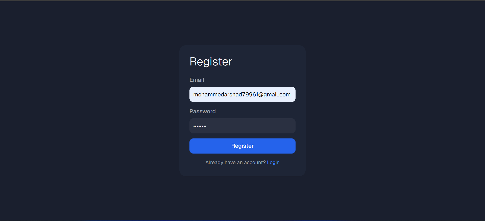
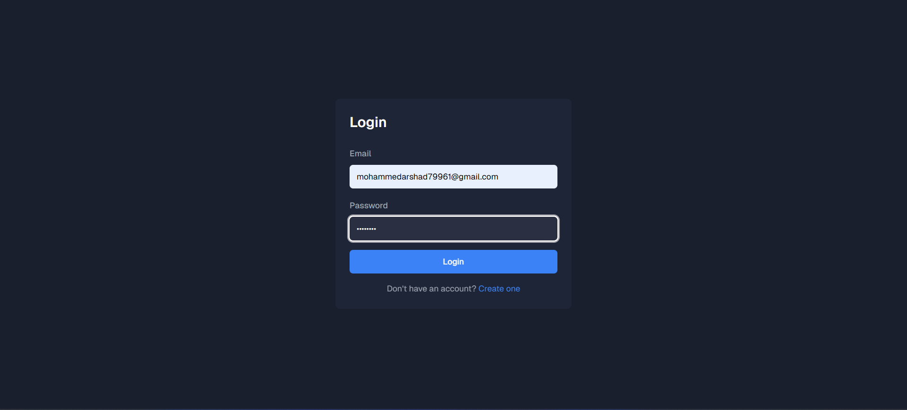

# AI-Integrated-Chat-App
AI-Integrated Project Collaboration Chat App is a web application built with the MERN stack (MongoDB, Express.js, React.js, and Node.js) designed to enhance team collaboration in software development. The app provides real-time communication within secure, project-specific chat rooms, ensuring that only invited members can participate in discussions.

In addition to basic chat features, This Chat App integrates Gemini AI to assist with coding tasks. Users can interact with the AI by typing @ai followed by their query to get coding solutions, explanations, or even AI-generated Express.js server code snippets. The platform also includes a built-in code editor, allowing users to modify and run server code directly in the browser via a web container, eliminating the need for local setups and speeding up testing and deployment.

